(File)Gallery
==================================================

You can create gallerys which will be shown on the gallery page of eventula where you can add images and files.
Also you can link the gallery to an event.
The file upload feature is amongst other things nice to provide demos of your last tournament.
The gallery feature is an optional system in eventula, so you have to enable it in order to use it.

The Gallery in the frontend will look something like this:

Overview with example album without an event linked

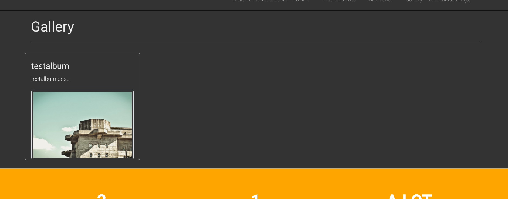

Overview with example album with an event linked

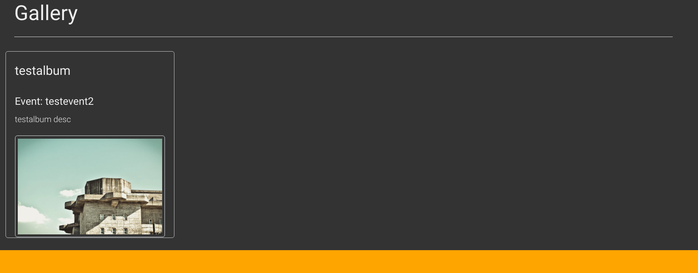

If a user clicks on it it will look like this:

.. warning::

       Currently the images are not correctly thumbnailed in the detailed view. Issue: https://github.com/Lan2Play/eventula-manager/issues/155

Detailed with example album without an event linked

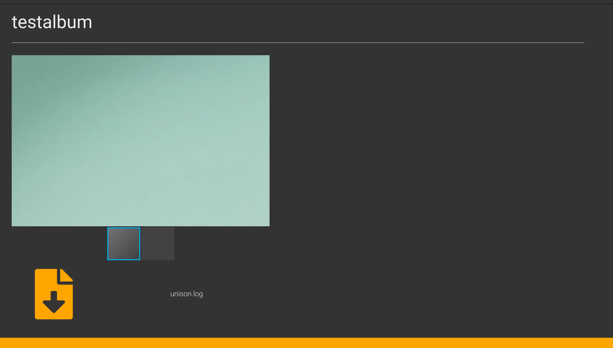

Detailed with example album with an event linked

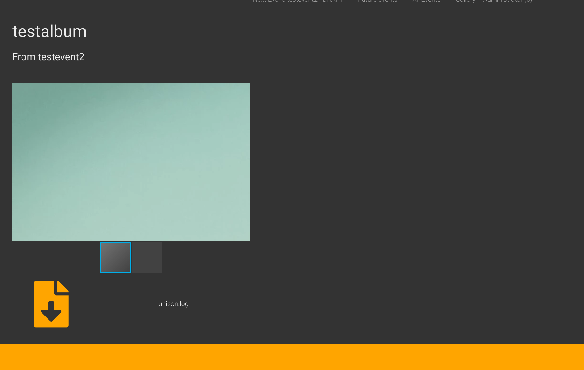

Enable/Disable Gallery
----------------------
To use the Gallery system and enable the link in your top navigation you have to enable it.
You can either refer to the settings documentation or use the buttons direcctly on the ``Gallery`` site in your admin panel:

Enable:

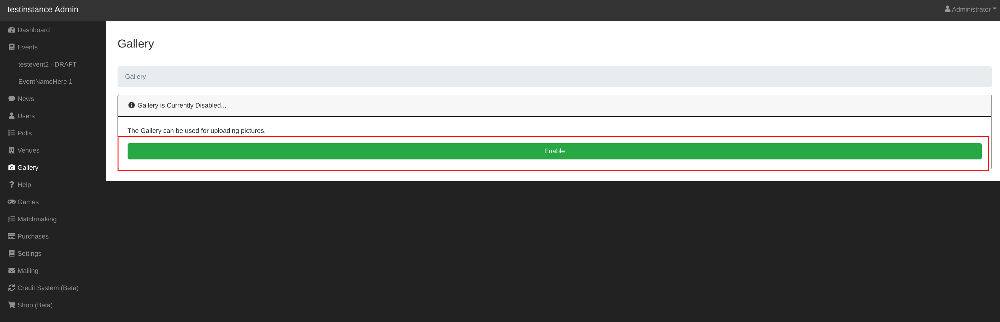

Disable:

.. image:: ../images/gallery_14.png
   :scale: 50 %
   :alt: eventula event deletion
   :align: center

Add Album
-----------------
Lets create an Album! go to your Admin Panel to the ``Gallery`` Section and you can add your venue in the ``Add Album`` area.
You have to fill in a name and you can add a description if you want to.

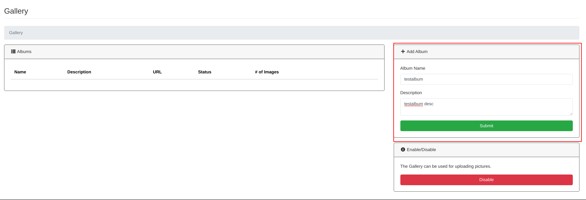

Press ``Submit`` to add the Album.

You will then be redirected to the detailed / editing /upload view.

Edit Album
-----------------
To enter the detailed / editing /upload view in the future, simply click ``Edit`` on the ``Albums`` list entry:

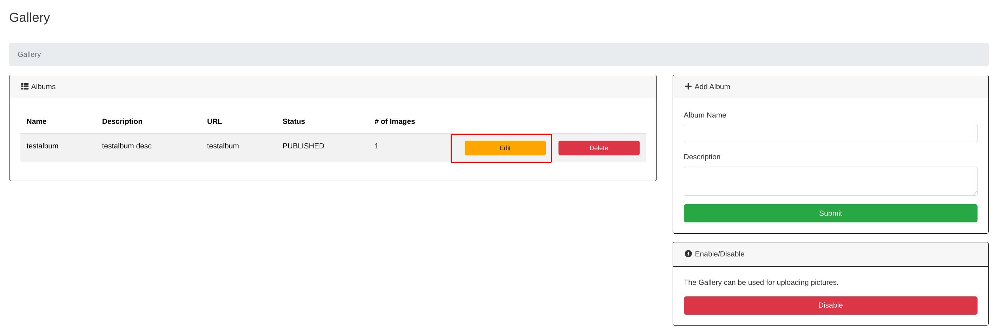

in the ``Settings`` area you can edit your albums name and description, change the status (if you want to hide a specific Album from the public) and
link/ unlink an event to it.
Here is an example how you can link an event to your created Album:

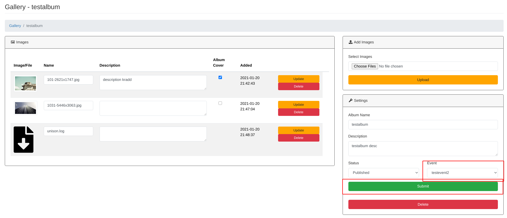

Dont forget to submit your settings.

Add images / files
-------------------
Go to the detailed / editing /upload view of your album and you can find a file picker in the ``Add Images`` area:  

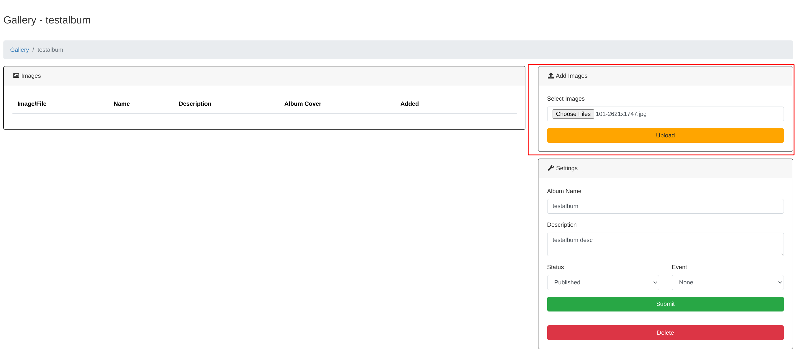

Just select (a) image(s)/file(s) and hit the Upload button.

Edit images / files
--------------------
Go to the detailed / editing /upload view of your album and you can find a list of all your files and images in the ``Images`` area.

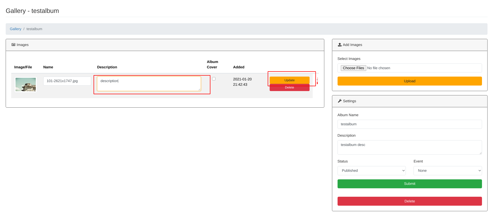

You can enter a description for each image / file and set one as the album cover (recommended to set one!).

.. warning::

       The image description is currently only visible in the admin panel! 

Delete images / files
-----------------------
Go to the detailed / editing /upload view of your album and you can find a list of all your files and images in the ``Images`` area.
Hit the corresponding ``delete`` Button of the image / file you want to delete and confirm the upcoming messagebox:

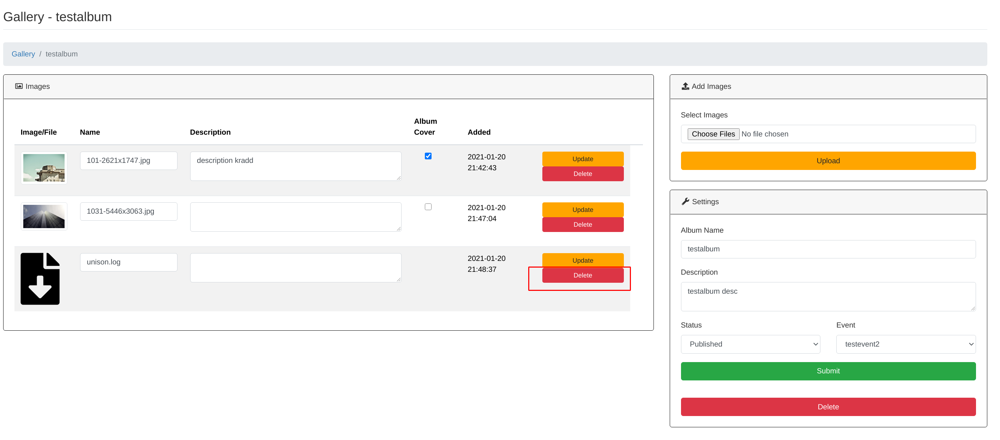

Delete Album
-------------

.. warning::

       If you delete an Album, all the images / files within it will be deleted too! 

To delete an Album simply click ``Delete`` on the ``Albums`` list entry on your ``Gallery`` admin page and confirm the upcoming messagebox:

.. image:: ../images/gallery_06.png
   :scale: 50 %
   :alt: eventula event deletion
   :align: center

