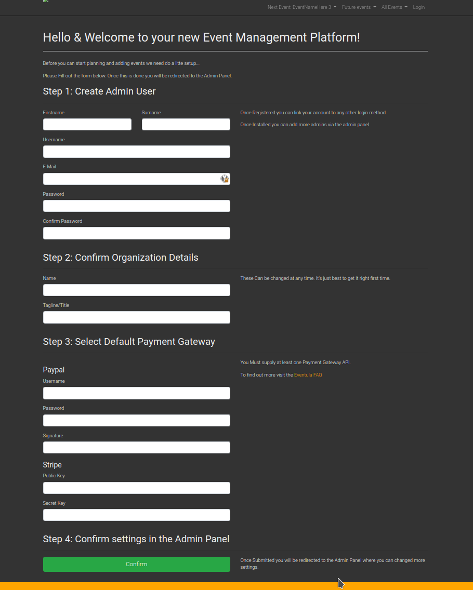

Getting Started
==================================================

    .. warning::

        This fork of eventula manager is not 100% update compatible to the current upstream. If you migrate from the upstream to our fork, please backup youre database and storage before doing so and please report any issues you encounter with the upgrade. Also this documentation is not fully up to date and not finished, so if you find something that is not right, consider contributing to it or open an issue. 

    .. note::
        If you want to try eventula locally instead of installing it directly in the production way, please go to :ref:`Developer getting started<dev/getting_started:Getting Started>` instead! 

We are glad that you want to try or use the eventula event manager.


Prerequisites
..............

- Docker v17+
- Docker-compose v1.18+
- API Keys for one of the Payment Providers
- Publicly reachable IP address 
- Domain with DNS entry pointing to above mentioned address

Installation
..................................................................

This method is intended to be run with docker-compose. It will create a full stack including :

- Database
- Load balancer
- letsencrypt SSL Encryption
- Automatic updates using watchtower

1. Generate an app key 
^^^^^^^^^^^^^^^^^^^^^^^^^
Just run the following command on any machine with docker installed, and you get your key. 

This key has to be inserted in the next step.

.. code-block:: bash

    docker run --rm composer:latest /bin/bash -c "echo 'generating key..' && composer create-project laravel/laravel example-app >/dev/null 2>/dev/null && cd example-app && php artisan key:generate >/dev/null 2>/dev/null && cat .env | grep APP_KEY=b"


2. Create your environment file
^^^^^^^^^^^^^^^^^^^^^^^^^^^^^^^^^^^^^^^^^^^^^^^^^^
create a folder where you put your .environment and your docker compose file in. 

Then create the ``.env`` file. 

Fill in the APP_KEY from the last step and all other empty Variables (if not optional ones).

.. code-block:: bash

    ###################
    ## User Settings ##
    ###################

    ## User for nginx and php-fpm. For production this should always be set to 82
    UUID=82
    GUID=82

    ##################
    ## App Settings ##
    ##################

    # Security key for laravel
    APP_KEY=
    # debugging mode (never turn on in production, this could leak sensitive information!)
    APP_DEBUG=false
    # application environment (never set it to something else when than production if used in production)
    APP_ENV=production
    # If set to true, the App and Nginx will log to a file instead of the docker logs.  Its recommended to set this to false in production
    LOG_FILES=false
    #Laravel HTTPS setting. If you use our example with LE SSL and traefik, set this to false! For Details read the HTTPS/Reverse Proxy sections in the Documentation (https://eventula.lan2play.de/admin/getting_started.html#https)
    ENABLE_HTTPS=false
    # APP HTTPS force  -  If you use our example with LE SSL and traefik, set this to true! For Details read the HTTPS/Reverse Proxy sections in the Documentation (https://eventula.lan2play.de/admin/getting_started.html#https)
    FORCE_APP_HTTPS=true
    # HTTPS Only Cookies - By setting this option to true, session cookies will only be sent back to the server if the browser has a HTTPS connection. This will keep the cookie from being sent to you if it can not be done securely.
    SESSION_SECURE_COOKIE=true
    # ENV Overide If set to true, the App will take its API Keys from the ENV instead of the database. This includes Paypal, Stripe, Facebook, Challonge, Google Analytics, Facebook Analytics and Steam. With the default setting, you have to configure those credentials below.
    ENV_OVERRIDE=true


    #######################
    ## Eventula Settings ##
    #######################
    
    # central eventula service url - Currently disabled by default since the central eventula service is down most of the time and this results in timeouts of the event admin page. To use the connection to eventula.com, set the env to 'https://eventula.com'
    EVENTULA_URL='DISABLE'


    ##################
    ## Org Settings ##
    ##################

    # site name
    APP_NAME=
    # site tagline
    APP_TAGLINE=
    # site url, set it to yourdomain.com (without any http[s] infront of!) 
    APP_URL=
    # site email
    APP_EMAIL=


    #########################
    ## Appearance Settings ##
    #########################
    
    #this will disable the linking and removal of the user scss. This should be only true if you mount your src folder inside the container, for example while developing. This should be false in a production environment! 
    APPEAR_DISABLE_CUSTOM_CSS_LINKING=false
    #this will disable the editing of the appearance settings in the Admin menu. This should be only true if you mount your custom scss into the container. For Details read the custom styling sections in the Documentation (https://eventula.lan2play.de/admin/getting_started.html#custom-styling)
    APPEAR_DISABLE_ADMIN_APPEARANCE_CSS_SETTINGS=false

    ##################
    ## Email Server ##
    ##################

    # mail driver, usualy smtp 
    MAIL_DRIVER=smtp
    # mail server host 
    MAIL_HOST=
    # mail server port 
    MAIL_PORT=
    # mail server username 
    MAIL_USERNAME=
    # mail server password 
    MAIL_PASSWORD=
    # mail server encryption, you should use it and set this value to tls
    MAIL_ENCRYPTION=


    ##############
    ## Database ##
    ##############

    # Database name (should be the same as in MYSQL_DATABASE)
    DB_DATABASE=eventula_manager
    # Database username (should be the same as in MYSQL_USER)
    DB_USERNAME=eventula_manager
    # Database password (should be the same as in MYSQL_PASSWORD)
    DB_PASSWORD=
    # Database host (should be the same used in the container_name value of the database container in the docker-compose.yml file)
    DB_HOST=eventula_manager_database
    # this sets if the databse seeders are running on the start of the instance. Its recommended to set this to true in production
    DB_SEED=true
    # this sets if the App will migrate the database on boot. Its recommended to set this to true in production
    DB_MIGRATE=true
    # this sets the databse type, we use mysql in the default docker-compose file.
    DB_CONNECTION=mysql
    # this sets the databse server port, we use mysql in the default docker-compose file, so the default port is 3306.
    DB_PORT=3306

    # Database name (should be the same as in DB_DATABASE)
    MYSQL_DATABASE=eventula_manager
    # Database username (should be the same as in DB_USERNAME)
    MYSQL_USER=eventula_manager
    # Database password (should be the same as in DB_PASSWORD)
    MYSQL_PASSWORD=
    # this sets if mysql generates a random root password on startup. Its recommended to set this to true in production
    MYSQL_RANDOM_ROOT_PASSWORD=true


    ##############
    ## Timezone ##
    ##############

    ## The Timezone names have to be valid Alpine linux tz names
    TIMEZONE=Europe/Berlin
    TZ=Europe/Berlin


    #######################
    ## Payment Providers ##
    #######################

    ## Paypal - https://developer.paypal.com/docs/api/overview/
    PAYPAL_USERNAME=
    PAYPAL_PASSWORD=
    PAYPAL_SIGNATURE=

    ## Stripe - https://stripe.com/docs/api
    STRIPE_SECRET_KEY=
    STRIPE_PUBLIC_KEY=


    ##########################
    ## Third Party Services ##
    ##########################

    ## Google Analytics (Optional) - https://api.google.com
    GOOGLE_ANALYTICS_TRACKING_ID=

    ## Steam (optional) - https://steamcommunity.com/dev/apikey
    STEAM_API_KEY=

    ## Tournaments (optional) - https://challonge.com/settings/developer
    CHALLONGE_API_KEY=

    ## Facebook (optional) - https://developers.facebook.com
    FACEBOOK_APP_ID=
    FACEBOOK_APP_SECRET=


3. Create your docker-compose.yml file
^^^^^^^^^^^^^^^^^^^^^^^^^^^^^^^^^^^^^^^^^^^^^^^^^^

``docker-compose.yml``

.. code-block:: yaml

    version: "3.4"
    services:
        app:
            image: lan2play/eventula-manager:latest
            restart: unless-stopped
            volumes:
            - eventula_manager_storage:/web/html/storage/
            expose:
            - "80"
            env_file:
            - ./.env
            container_name: eventula_manager_app
            labels:
            - "com.centurylinklabs.watchtower.scope=ev01"
            - "traefik.enable=true"
            - "traefik.http.routers.ev01.rule=Host(`${APP_URL}`)"
            - "traefik.http.routers.ev01.entrypoints=websecure"
            - "traefik.http.routers.ev01.tls.certresolver=le"
            - "traefik.http.services.myservice.loadbalancer.server.port=80"
        database:
            image: mysql:8
            restart: unless-stopped
            volumes:
            - eventula_manager_database:/var/lib/mysql
            env_file:
            - ./.env
            container_name: eventula_manager_database
            labels:
            - "com.centurylinklabs.watchtower.scope=ev01"
        loadbalancer:
            image: traefik:latest
            restart: unless-stopped
            volumes:
            - /var/run/docker.sock:/var/run/docker.sock:ro
            - eventula_manager_acme:/acme:z
            env_file:
            - ./.env
            ports:
            - 80:80/tcp
            - 443:443/tcp
            command:
            - --providers.docker=true
            - --entryPoints.web.address=:80
            - --entryPoints.web.http.redirections.entryPoint.to=websecure
            - --entryPoints.web.http.redirections.entryPoint.scheme=https
            - --entryPoints.websecure.address=:443
            - --providers.docker.exposedByDefault=false
            - --certificatesresolvers.le.acme.email=${APP_EMAIL}
            - --certificatesresolvers.le.acme.storage=/acme/acme.json
            - --certificatesresolvers.le.acme.tlschallenge=true
            container_name: eventula_manager_loadbalancer
            labels:
            - "com.centurylinklabs.watchtower.scope=ev01"
        watchtower_ev01:
            image: containrrr/watchtower
            restart: unless-stopped
            volumes:
            - /var/run/docker.sock:/var/run/docker.sock
            command: '--interval 240 --cleanup --scope ev01'
            labels:
            - "com.centurylinklabs.watchtower.scope=ev01"
            container_name: eventula_manager_watchtower
    volumes:
        eventula_manager_database:
            name: eventula_manager_database
        eventula_manager_storage:
            name: eventula_manager_storage
        eventula_manager_acme:
            name: eventula_manager_acme

4. Start your stack and wait
^^^^^^^^^^^^^^^^^^^^^^^^^^^^^^^^^^^^^^^^^^^^^^^^^^

Run ``docker compose up -d && docker compose logs -f`` or ``docker-compose up -d && docker-compose logs -f`` depending on your docker compose version. 

Give the stack a few minutes to start. In the beginning there will be errors that come from the missing database availability, you can ignore them.

After a few minutes your log should show ``NOTICE: ready to handle connections`` and should be reachable with ``https://$APP_URL`` in your browser.


5. Installation Page
^^^^^^^^^^^^^^^^^^^^^^^^^^^^^^^^^^^^^^^^^^^^^^^^^^
the last step before you can use the event manager is the installation page, it will pop up after the initial startup.

- You have to fill out all the input fields in Step 1 & Step 2 
- You have to fill out at least the API credentials for one of the payment providers in Step 3 
- Finnaly click on Confirm to get redirected to your working Managers settings Page.




6. After the Installation
^^^^^^^^^^^^^^^^^^^^^^^^^^^^^^^^^^^^^^^^^^^^^^^^^^

- To get to your front page, klick on the page title at the top left. 

- If you want to go back to the Admin area you can do this by opening the menue while clicking onto your username in the top right corner and the entry ``Admin``.

- If you want to know all about the settings, take a look into the :ref:`admin/settings/basic:Settings` documentation. 


HTTPS
..................................................................

    .. warning::

        This is not relevant when using our example from above! Only set ENABLE_HTTPS to true if you want to do SSL termination within the eventula containers nginx. It is not recommended to use eventula without a reverse proxy infront of.

To enable HTTPS directly on the eventula container set ``ENABLE_HTTPS=true``. 

If you wish to use your own certs, copy them to ``resources/certs`` or mount in the certs to the ``/etc/nginx/certs`` directory on the container. 

You have to rename the certs to ```eventula_manager.crt``` and ```eventula_manager.key```.


Running behind a reverse proxy
..................................................................

    .. warning::

        This is not relevant when using our example from above, as its already configured this way! If you want to use your own reverseproxy instead of traefik, you have to remove the whole loadbalancer Section and all the labels starting with ``treafik`` from your ``docker-compose.yml``.

If you want to run eventula with http and a reverse proxy in front which serves it to the web via https you have to enable set ``ENABLE_HTTPS=false`` and ``FORCE_APP_HTTPS=true`` in your env file / your docker-compose.yml . 

This will run the NGINX running eventula in http mode but it will force the https link schema for all the links in eventula.


Secret Managers
..................................................................
The Event Manager ships with a file reader for Env variables such as Passwords as API Keys for Secrets Managers such as Ranchers Secret Manager, EnvKey and Summon. To use it append ``_FILE`` to the Env variable and change the value to be the location of the secret file located on the container! It is recommended you mount a secrets directory into the container for example:

If we add the volume; ``resources/secrets/:/run/secrets`` and store our ``DB_PASSWORD`` in a file called ``DB_PASSWORD`` in ``resources/secrets/`` directory, we can set ``DB_PASSWORD_FILE=/run/secrets/DB_PASSWORD`` and the app will read the file and inject the password into the Environment Variable ``DB_PASSWORD``.

Caveats
^^^^^^^^^^^^^^^^^^^^^^^^^

- Only one entry per file
- File must only container value
- The file can be named anything, but it must be reflected in the ``_FILE`` env variable
- It will only work on the following Env Variables;

  - ``APP_URL``
  - ``APP_EMAIL``
  - ``DB_PORT``
  - ``DB_HOST``
  - ``DB_PASSWORD``
  - ``MAIL_HOST``
  - ``MAIL_USERNAME``
  - ``MAIL_PASSWORD``
  - ``STEAM_API_KEY``
  - ``CHALLONGE_API_KEY``
  - ``APP_KEY``
  - ``CHALLONGE_API_KEY``
  - ``FACEBOOK_APP_ID``
  - ``FACEBOOK_APP_SECRET``
  - ``STRIPE_PUBLIC_KEY``
  - ``STRIPE_SECRET_KEY``
  - ``PAYPAL_USERNAME``
  - ``PAYPAL_PASSWORD``
  - ``PAYPAL_SIGNATURE``
  - ``ANALYTICS_TRACKING_ID``
  - ``ANALYTICS_TRACKING_ID``
  - ``ANALYTICS_TRACKING_ID``
  - ``ANALYTICS_TRACKING_ID``
  - ``APPEAR_DISABLE_CUSTOM_CSS_LINKING``
  - ``APPEAR_DISABLE_ADMIN_APPEARANCE_CSS_SETTINGS``
  - ``ENV_OVERRIDE``


Custom Styling
..................................................................

By default eventula will copy the two relevant files for customisation into ``/web/html/storage/user/scss`` folder, which therfore is in your storage mount and use those afterwards. 

To recompile or customize these SCSS files use the http://localhost/admin/appearance (change localhost ofc with the URL of your eventula host). For more Information look into :ref:`admin/settings/basic:Appearance`

If you want to bring those two files ( ``_user-variables.scss`` and ``_user-override.scss``) with your compose file, please mount them to that folder mentioned above. 

.. warning::
    Keep in mind that if you do so, the ``_user-variables.scss`` overwrite the Appearance settings in the database only on the startup of the container. And hitting save in the :ref:`admin/settings/basic:Appearance` settings also will overwrite your mounted  ``_user-variables.scss`` . You can prevent the editing in the Admin panel with setting the Env ``APPEAR_DISABLE_ADMIN_APPEARANCE_CSS_SETTINGS`` to ``true`` .

.. warning::

    Mounting them to they're regular path ( ``/web/html/resources/assets/sass/app/modules`` / ``/web/html/resources/assets/sass/app/components`` ) will get them deleted on the container startup (see APPEAR_DISABLE_CUSTOM_CSS_LINKING in https://github.com/Lan2Play/eventula-manager/blob/master/resources/docker/root/run/docker-entrypoint.sh)


