Help System
==================================================
You can create help articles which will be shown on the help page of eventula.
Also you can add files to the articles (and images via the wysiwyg editor).
The help feature is an optional system in eventula, so you have to enable it in order to use it.

The Help page will look something like this (users can also search here):

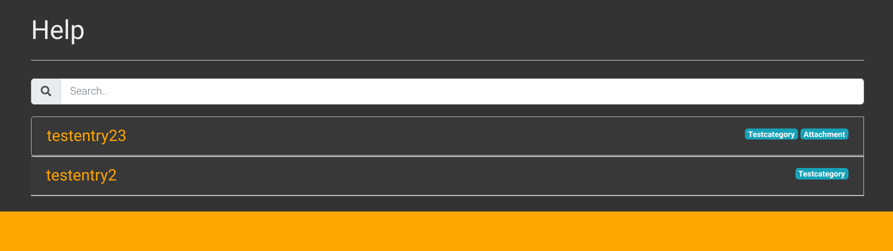

if a user expands one article with attachments by clicking on it:

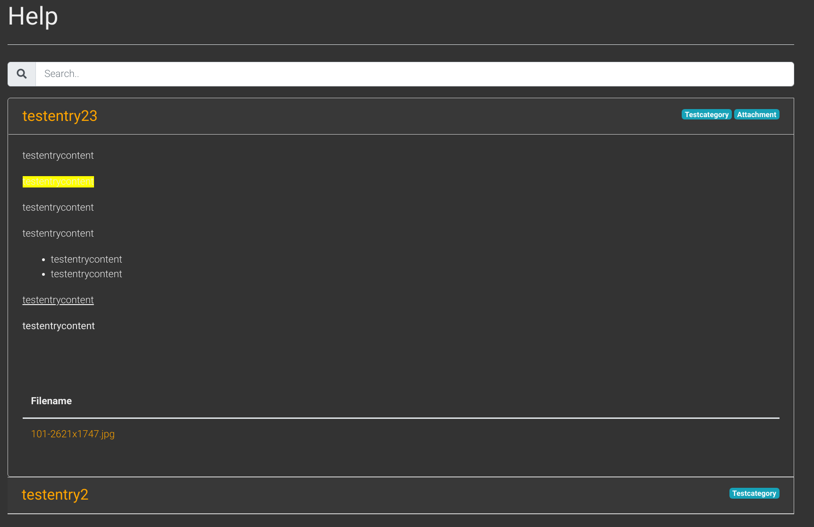

if a user expands one article without attachments by clicking on it:

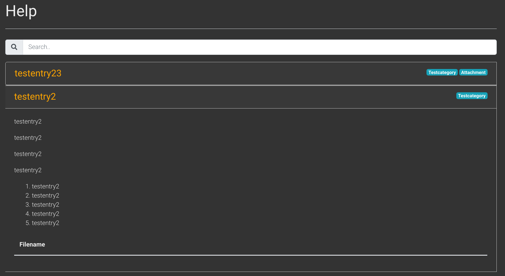

Enable/Disable Help
----------------------
To use the help system and enable the link in your top navigation you have to enable it.
You can either refer to the settings documentation or use the buttons direcctly on the ``Gallery`` site in your admin panel:

Enable:

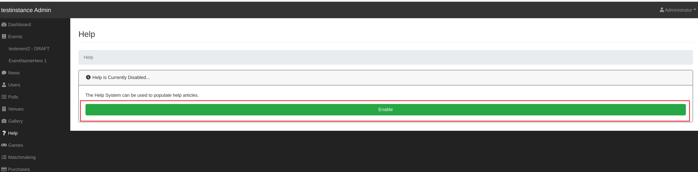

Disable:

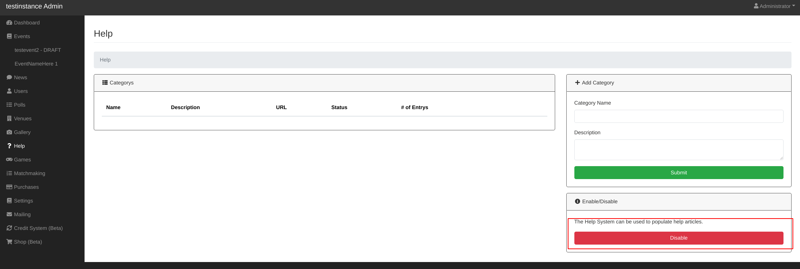

Add Help category
-----------------
Lets create a help category! go to your Admin Panel to the ``Help`` Section and you can add your category in the ``Add category`` area.
You have to fill in a name and you can add a description if you want to.

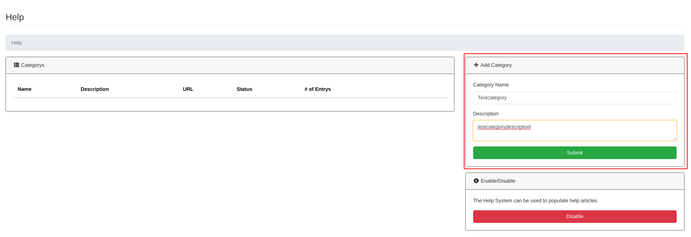

Press ``Submit`` to add the Category.

You will then be redirected to the detailed / editing /upload view.

Edit Help category
------------------
To enter the detailed / editing /upload view in the future, simply click ``Edit`` on the ``Categorys`` list entry:

in the ``Settings`` area you can edit your categorys name and description, change the status (if you want to hide a specific category from the public) and
link/ unlink an event to it.

.. warning::

       The event link currently does nothing! 

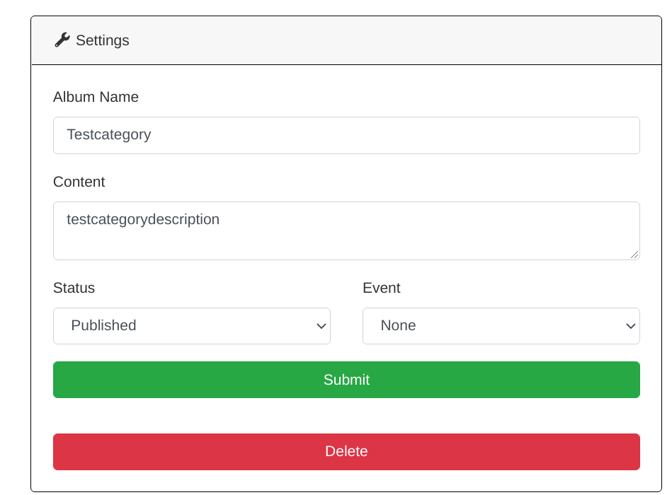

Dont forget to submit your settings.

Delete Help category
---------------------

.. warning::

       If you delete an Help category, all the entrys / attachments within it will be deleted too! 

To delete a help category simply click ``Delete`` on the ``Categorys`` list entry on your ``Help`` admin page and confirm the upcoming messagebox:

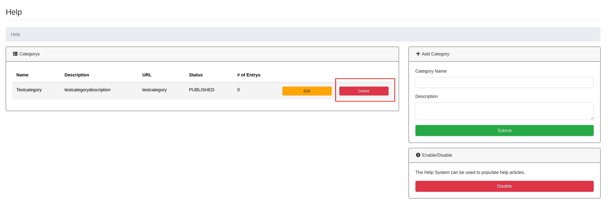

Add helpentry
-------------------
Go to the detailed / editing /upload view of your help category and fill the Name and the Content in the ``Add Entry`` area:  

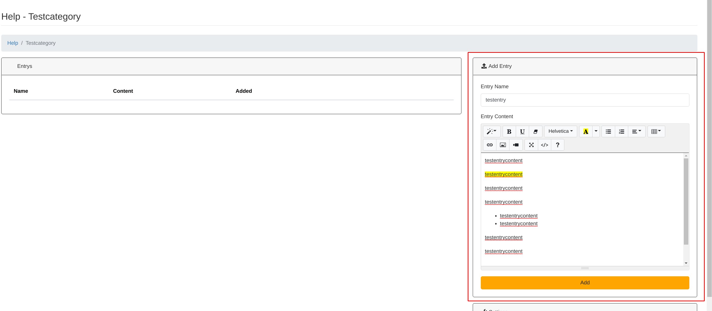

Don't forget to press submit.

Edit helpentry
--------------------
Go to the detailed / editing /upload view of your help category and you can find a list of all your entrys in the ``Entrys`` area.

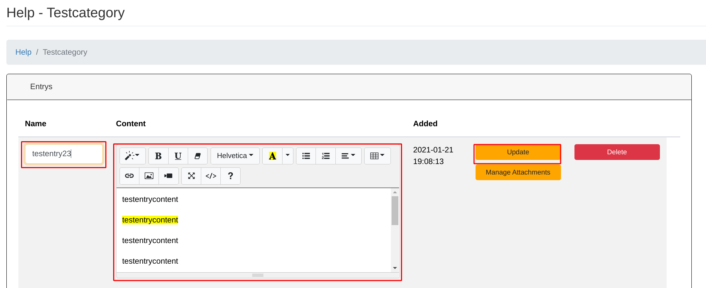

Edit to your needs and press the ``Update`` button.

Delete helpentry
-----------------------
Go to the detailed / editing /upload view of your help category and you can find a list of all your entrys in the ``Entrys`` area.
Hit the corresponding ``delete`` Button of the entry you want to delete and confirm the upcoming messagebox:

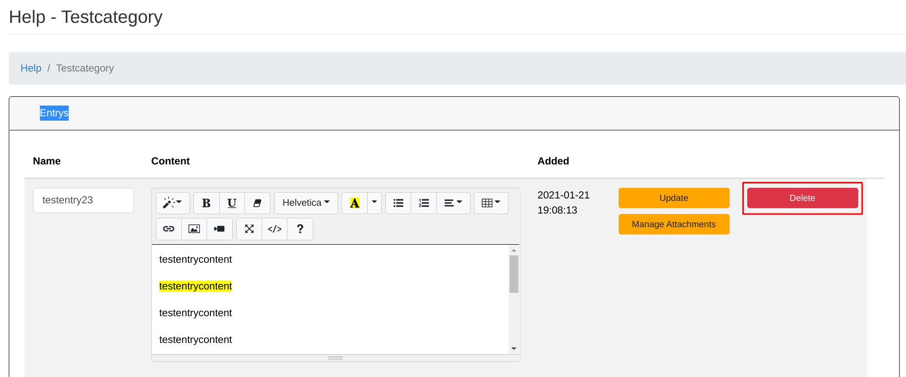

Add attachment to entry
-------------------------
Go to the detailed / editing /upload view of your help category and you can find a list of all your entrys in the ``Entrys`` area.
To get to the attachmets management klick the corresponding ``Manage Attachments`` button.

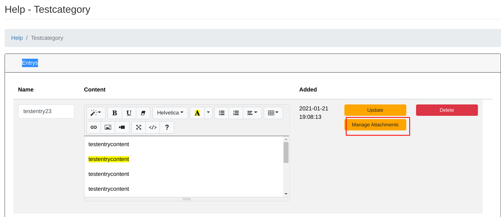

Here you can find a file picker, just pick a file and hit the ``Upload`` button.

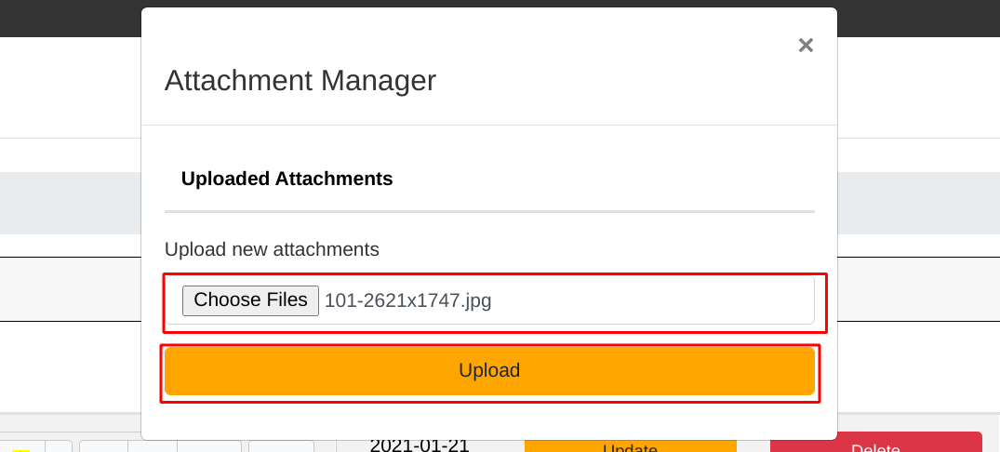

Delete attachment from entry
-----------------------------
Go to the detailed / editing /upload view of your help category and you can find a list of all your entrys in the ``Entrys`` area.
To get to the attachmets management klick the corresponding ``Manage Attachments`` button.

Here you can find a list of all files, just hit the corresponding ``Delete`` button.

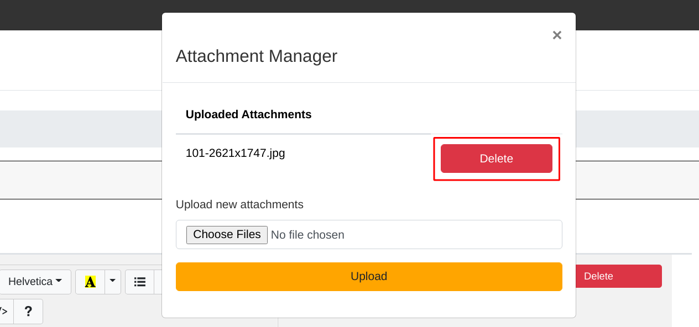