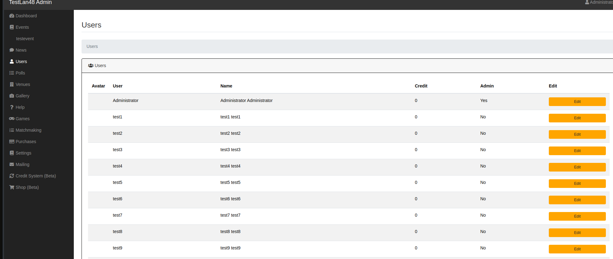
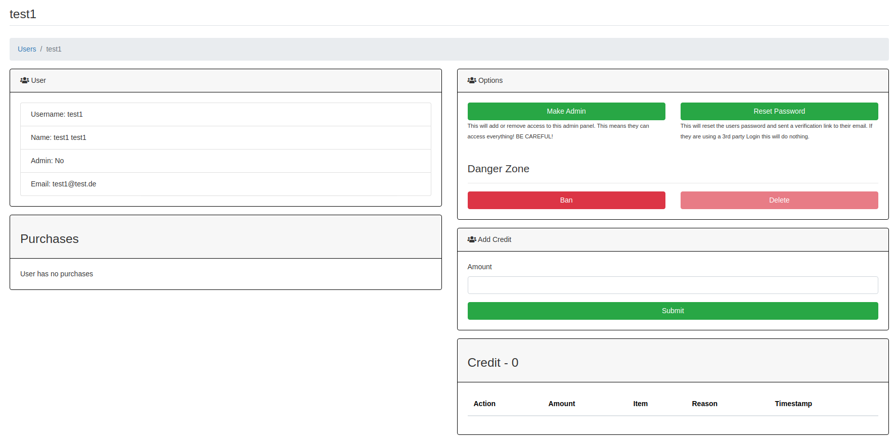
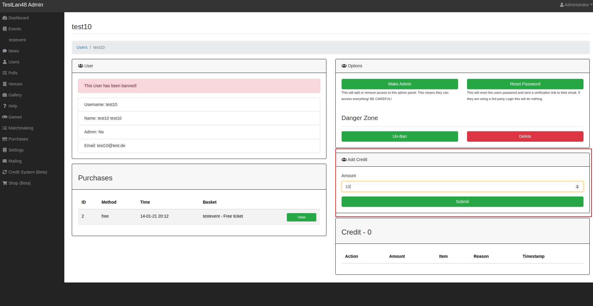

Usermanagement
==================================================

In the ``Users`` administration area you can see all your users listed with they're current credit status and you can see if they're admins:

When you click on ``Edit`` you will get to the detailes user view, here you are able to see the personal Data of the user, the users purchases, the users creditlog and you can do some management:

.. warning::

        With the ``Make Admin`` button you can grant a user access to the whole admin panel, be careful!  You can always revoke admin rights with the ``Remove Admin`` Button.

The ``Reset Password`` button sends the users a password reset email if they have no 3rd party login activated.

The ``Ban`` button bans the users account, so all the features would not work if the user is logged in, if the session of the user is ended, the account could not be used to login anymore and the e-mail address is blocked for registration.
You can always unban accounts with the ``Un-Ban`` Button.

.. warning::

        With the ``Delete`` button you can delete a user account completely! Be careful, because you loose the whole data for the user, even the event, purchase and credit data of the user! This feature can cause problems, if you encounter errors here, please report them via Github issues! [look into the Contribution Guide here in the manual]

In the ``Add Credit`` section you can gift credits manually to users:

for more information look into the Credit System documentatin.
