Games
==================================================

Basic
-----
You can create games which will be available in your event, your tournaments and your matchmaking.
You are then able to add gameservers for each game and for a few games you can show serverstats / remote control the servers from eventula or even automate your matchmaking or tournament.

Add Game
.........
Lets create a game! go to your Admin Panel to the ``Games`` Section and you can add your game in the ``Add Game`` area.
To use the basic features like manual tournaments you have to fill in a name and you can add a description, a version if you want to.
Its recommended to add a ``Thumbnail Image`` and a ``Header Image``, they will be shown on the tournaments / matches.

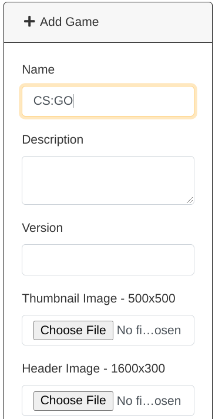

If you want to enable the possibilities to show the status of the later created gameservers on either the events page or the public page or you want to remotly control the gamservers via eventula you have to select a ``Game Commandhandler``

The currently available Commandhandlers are:

- SourceQuery GoldSource (supported games: full support for all HL1/HL2 games and mods )
- SourceQuery Source (supported games: CS:GO, Minecraft only commands | no status support)
- Maniaplanet XRPC (supported games: Trackmania nations, and all new maniaplanet games )

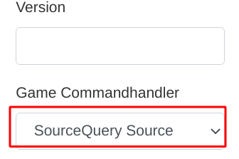

If you want to enable the possibilities to manage fully automated tournaments or fully automated matchmaking you have to set ``Game Match Api handler`` as well as the corresponding ``Game Commandhandler``. 

The currently available APIhandlers are: 

- Get5 (supported games: CS:GO with the `Get5 Plugin from Splewis <https://github.com/splewis/get5>`_ and the `get5_eventula_apistats plugin <https://github.com/Lan2Play/get5_eventula_apistats>`_)

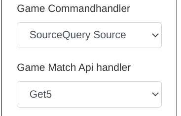

For an explanation of the fields ``Connect Game URL``, ``Connect Game Command`` and ``Connect Stream URL`` take a look on the ``Frontend Gameserver Features`` section of the documentation.

For a fully working example of the automated Tournament / Matchmaking take a look on the ``Tutorials`` section of the documentation.

Press ``Submit`` to add the Category.

You will then be redirected to the detailed / editing /upload view. 

Edit Game
.........
To edit a game, go to your Admin Panel to the ``Games`` Section and klick on ``Edit`` on the game entry in the ``Games`` area.

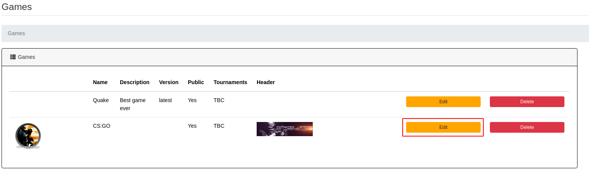

You will then be redirected to the detailed / editing /upload view of the game. 

You can edit the games parameters in the ``Edit Game`` Section. Additionally to the parameters you had available in the Add Game step, you can set the public visibillity of a game (Currently not working!) and a ``Match start command`` that is needed for the automatic tournament / matchmaking (see the ``Add Game`` section of the documentation or for a fully working example of the automated Tournament / Matchmaking take a look on the ``Tutorials`` section of the documentation.)

For an explanation of the fields ``Connect Game URL``, ``Connect Game Command`` and ``Connect Stream URL`` take a look on the ``Frontend Gameserver Features`` section of the documentation.

The changes can be saved with a click on the ``Submit`` Button in the ``Edit Game`` Section.

In the bottom you can now add Game Servers to the game. Please look into the following ``Gameservers`` section of the documentation.

Gameservers
-----------

Add Gameserver
..................

To show gameservers on your event live page, and to enable the automatic Matchmaking / Tournament Features, you can add Gameservers to any game. Lets create a game server! go to your Admin Panel to the ``Games`` Section and klick on ``Edit`` on the game entry in the ``Games`` area on which you want to add a gameserver.
In the bottom you can now add Game Servers to the game in the ``Add Game Server`` section: 

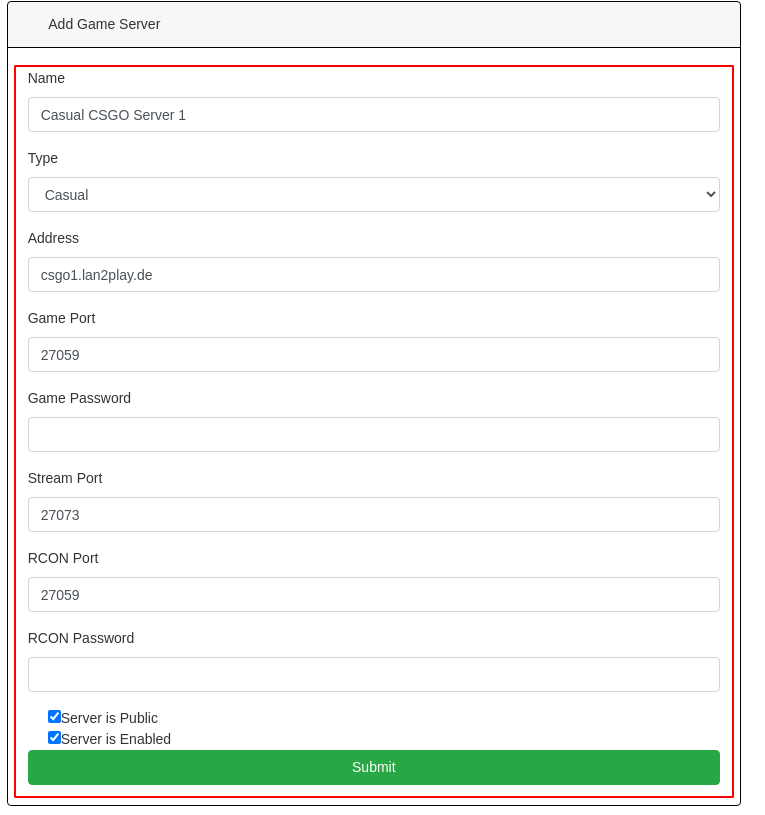

- You have to specify at least the ``Name``, the ``Adress`` (or ip), the ``Type`` and the ``Game Port``.
- If you select the ``Type`` ``Casual`` and ``Server is Enabled``, the Server will be shown on your events live page. 
- If you select the ``Type`` ``Casual``, ``Server is Enabled`` and ``Server is Public`` the Server will be shown on your events live page and your homepage.
- If you select the ``Type`` ``Match`` and ``Server is Enabled`` the Server will be used for Matchmaking and tournaments if you enable it on the game itself.
- If your Server needs a connection password, you can specify it in ``Game Password``.
- Some games support streaming (like CS:GO). To enable your users to stream the game, you can enter the streaming port (eg. Sourcetv) in the ``Stream Port`` field.
- If you use a game with a supported Commandhandlers (See the ``Add Game`` section in the documentation), you should add the ``RCON Port`` (mostly same as the game port) and the ``RCON Password`` to enable status checking or (automatic) remote controlling of the Gameserver.

Edit Gameserver
..................

Frontend Gameserver Features
....................................

The basic view of a Gameserver with no Commandhandler selected looks like this on the event live page:

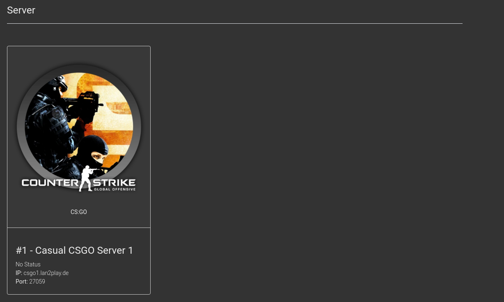

and like this on the Homepage:

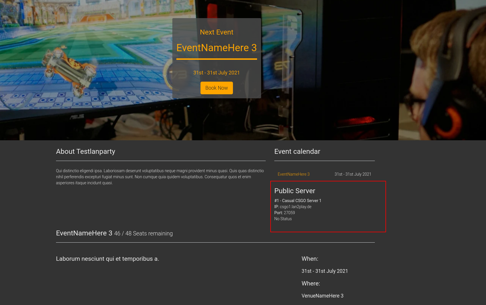

Some Games support joining to a server via a URL or a command. To enable that you have to fill the fields ``Connect Game URL``, ``Connect Game Command`` and ``Connect Stream URL`` in your corresponding game.

You can use variables in these fields which get resolved for the end user.

- Use Variables in commands like this: {>gameServer}
- If the used variable contains an object the Properties can also be accessed: {>gameServer->address} or {>gameServer->rcon_port}
- If you need the parameter as an optional parameter (for example the password for the connect url/command: {>§gameserver->password}

The available variables are:

- {>gameServer->address}
- {>gameServer->game_port}
- {>§gameServer->game_password}
- {>gameServer->stream_port}

Examples:

- So for example your ``Connect Game URL`` for a steam game could look something like that:
``steam://connect/{>gameServer->address}:{>gameServer->game_port}/{>§gameServer->game_password}``

- Also for example your ``Connect Game Command`` for a steam game could look something like that:
``password {>§gameServer->game_password}; connect {>gameServer->address}:{>gameServer->game_port}``

- Also for example your ``Connect Stream URL`` for a steam game could look something like that:
``steam://connect/{>gameServer->address}:{>gameServer->stream_port}``

If you set everything, your Server looks like this in the event live view:

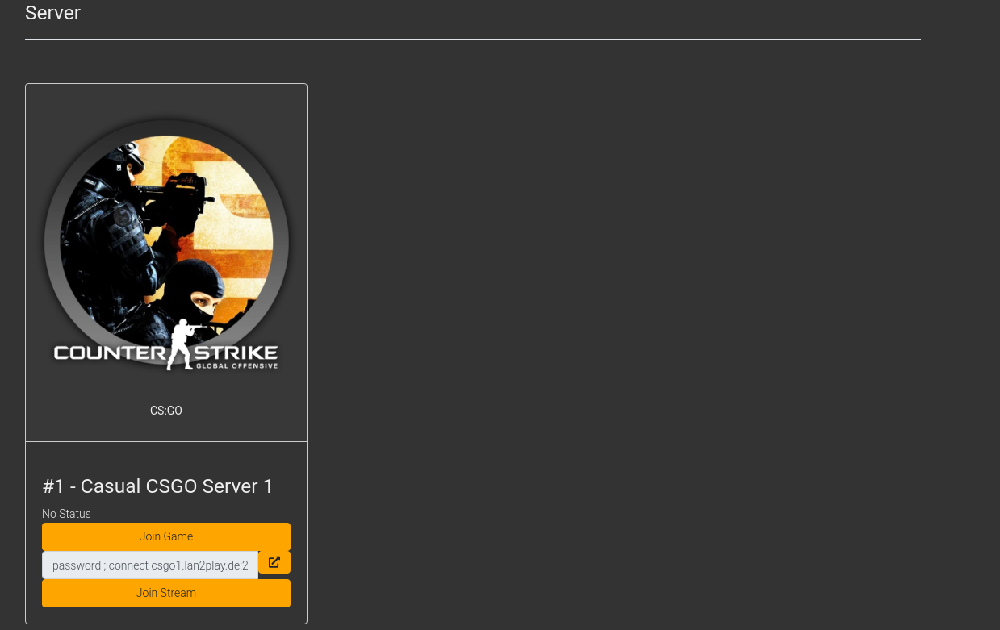

And like this on your Homepage:

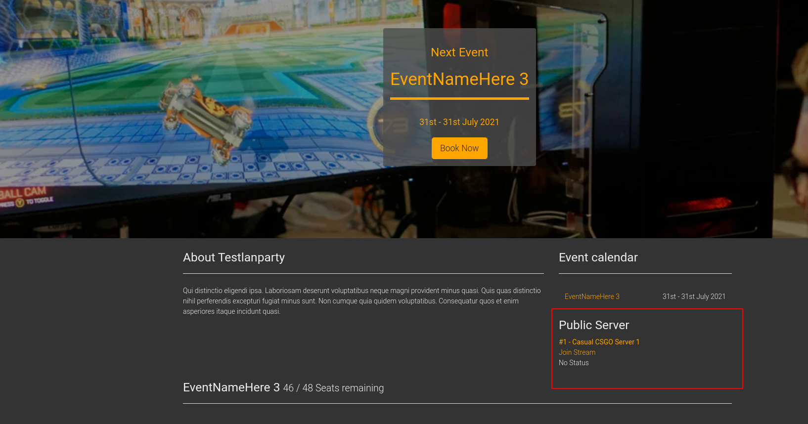

if you set the ``Commandhandler`` and the ``RCON password`` and the ``RCON Port`` on your game the status of your Server is shown in both views and in the Admin Area:

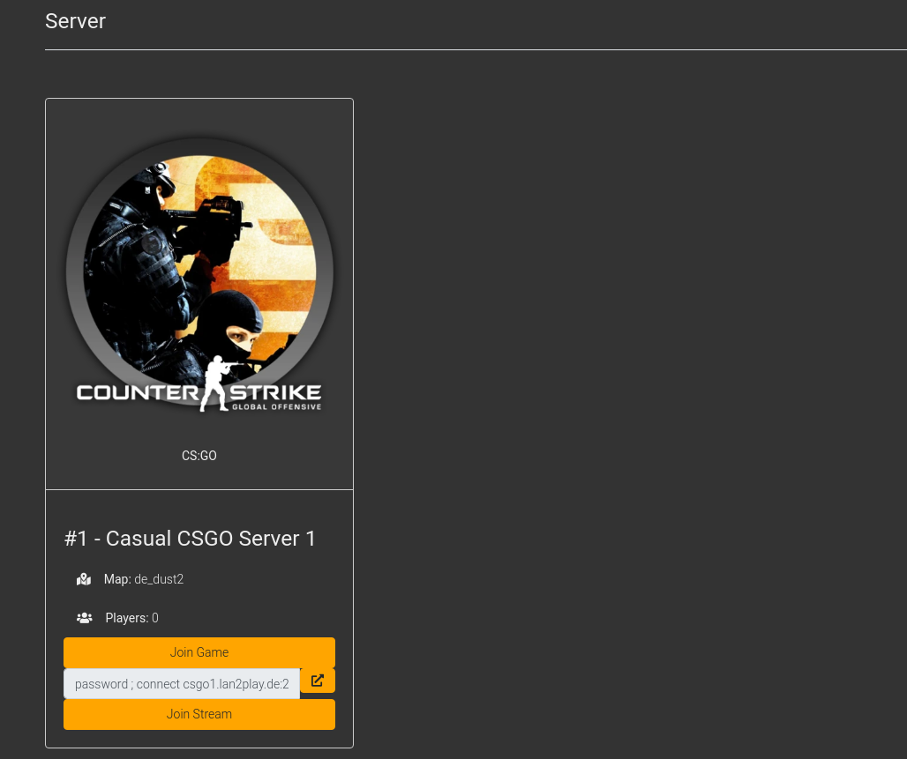

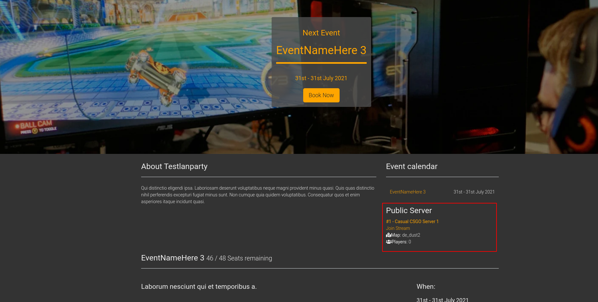

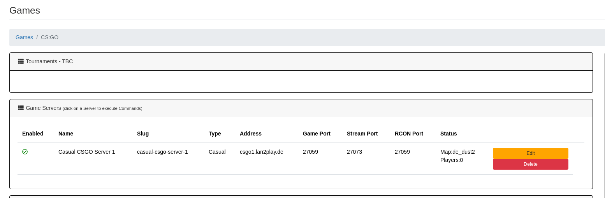

GameCommands
------------

GameCommandParameters
---------------------
