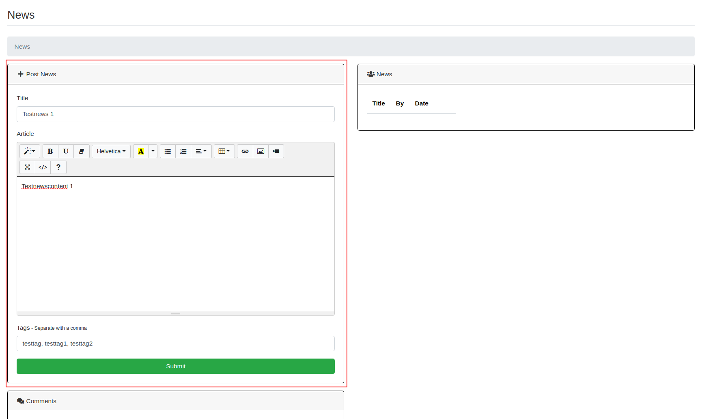
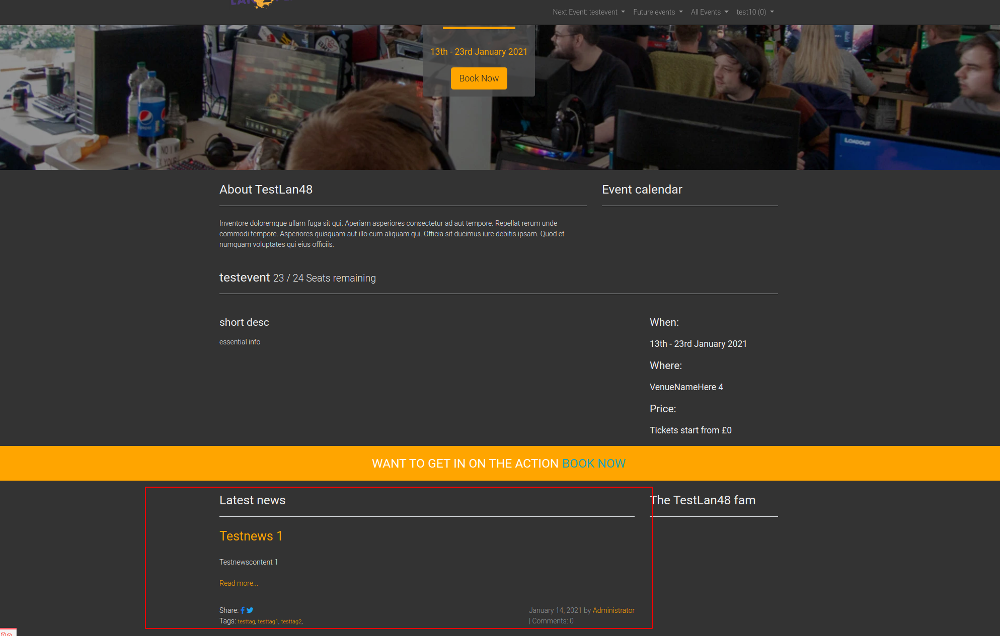
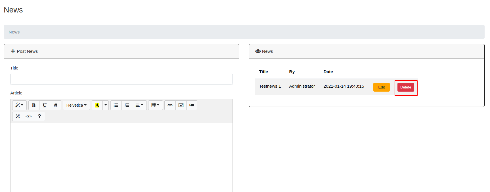
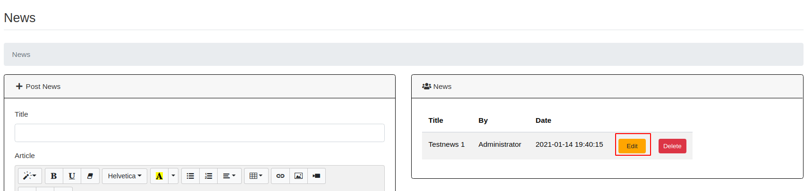
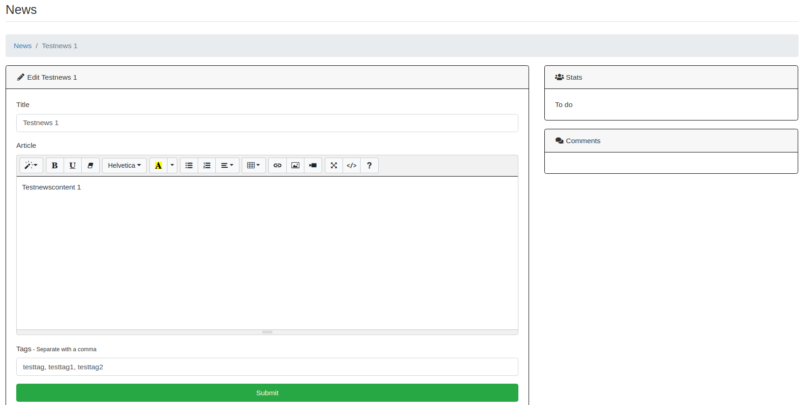
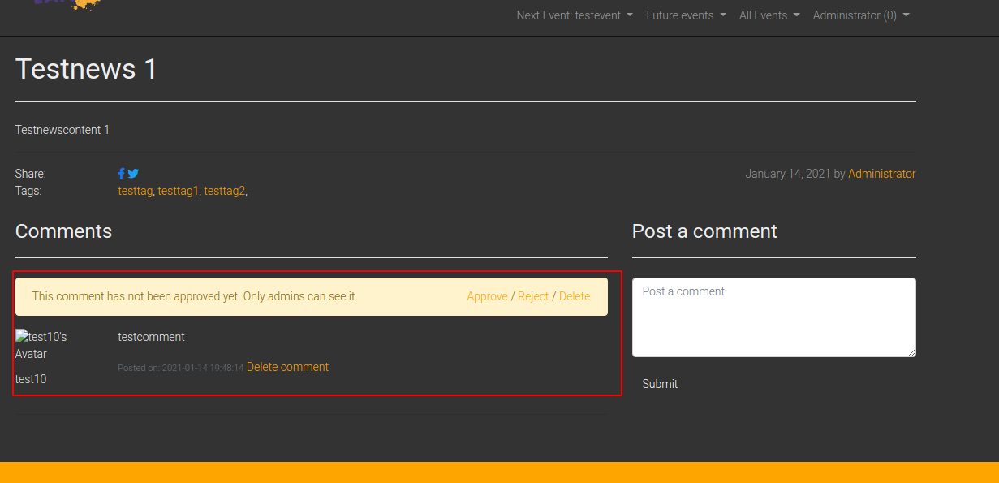
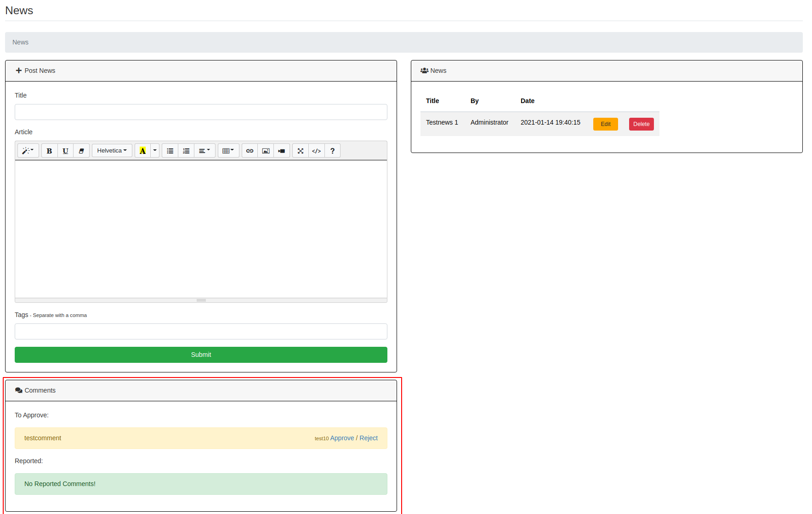

News
==================================================

You can create News articles which will be shown on the home page of eventula and all users can add comments to the entrys.
Each comment has to be approved by an administrator and can be reported by users as well.

Add News article
-----------------

Lets create a News article! go to your Admin Panel to the ``News`` Section and you can Write your entry in the ``Post News`` area.
You have to fill everything, including tags:

Press ``Submit`` to add the entry.

Now it is visible on the Eventula home page:

If users click on ``Read more...`` they get the full view (and a comment Window and reporting abilitys if they are logged in).
If admins click on ``Read more...`` they can moderate comments here (Approve / Reject / delete) [see Moderating Comments section]

Delete News article
--------------------

To delete a news article simply click ``Delete`` on the ``News`` list entry and confirm the upcoming messagebox:

Edit News article
------------------

To delete a news article simply click ``Edit`` on the ``News`` list entry:

You can now edit everything and save the changes with the ``Submit`` Button:

Over the right you also get a list with all the comments users made on the article.

Moderating Comments
-------------------

As mentioned before, comments can either be moderated in the News detail view via the homepage if you are logged in as an administrator:

or you can see all unapproved / reported comments in your Admin panel:

If a comment is already approved they will be visible to other users and the public.
It can be always reported by users in the frontend and you can delete them either in the frontend or in the Admin panel if you go to the ``Edit News Article`` view.
