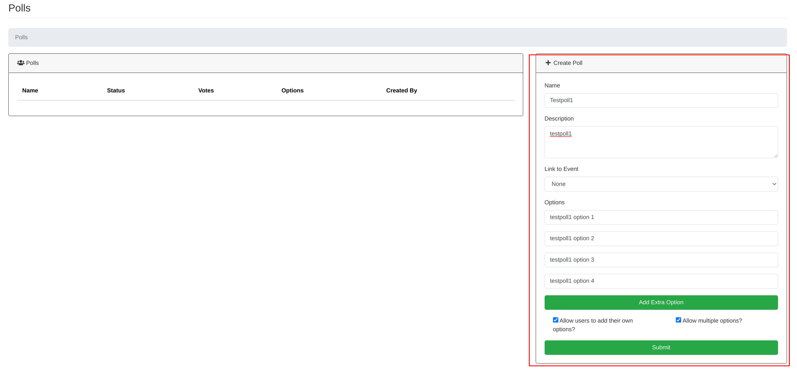
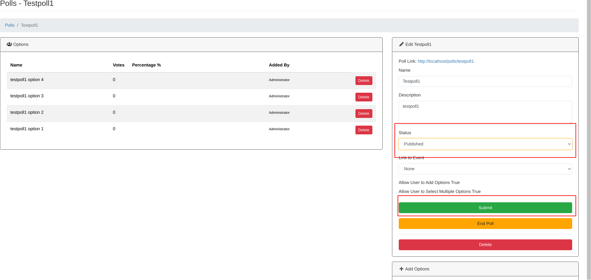
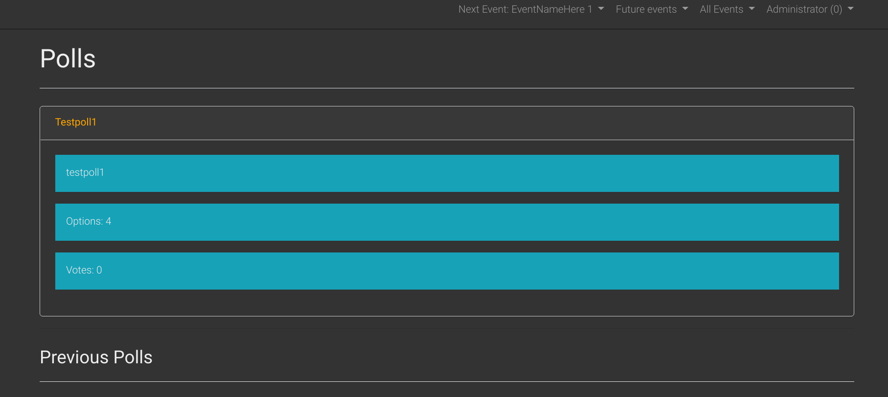
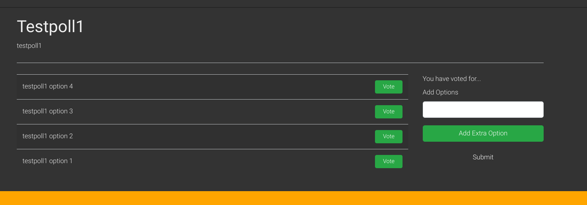
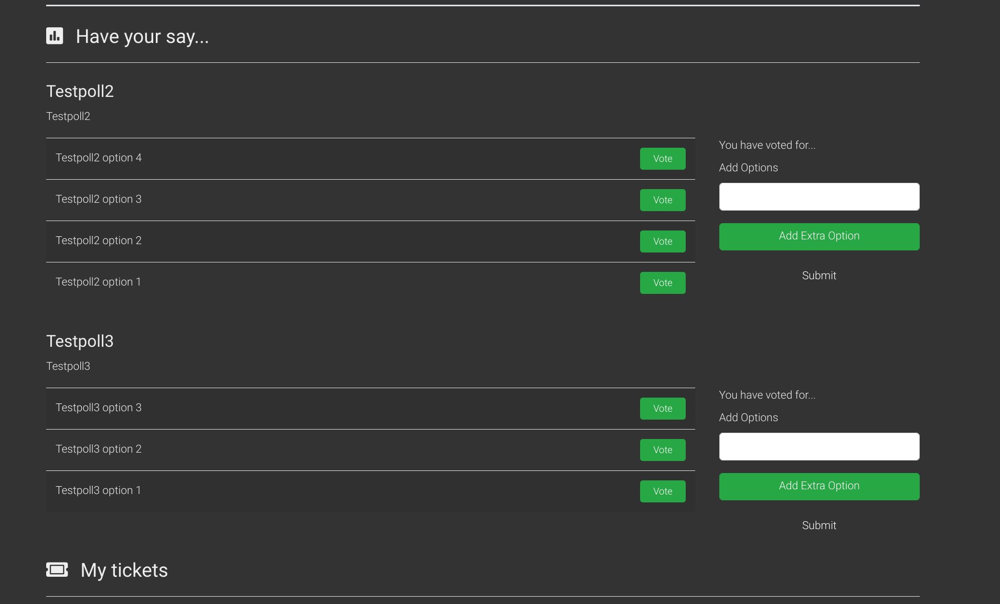
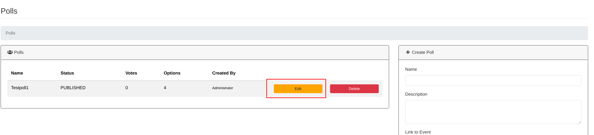
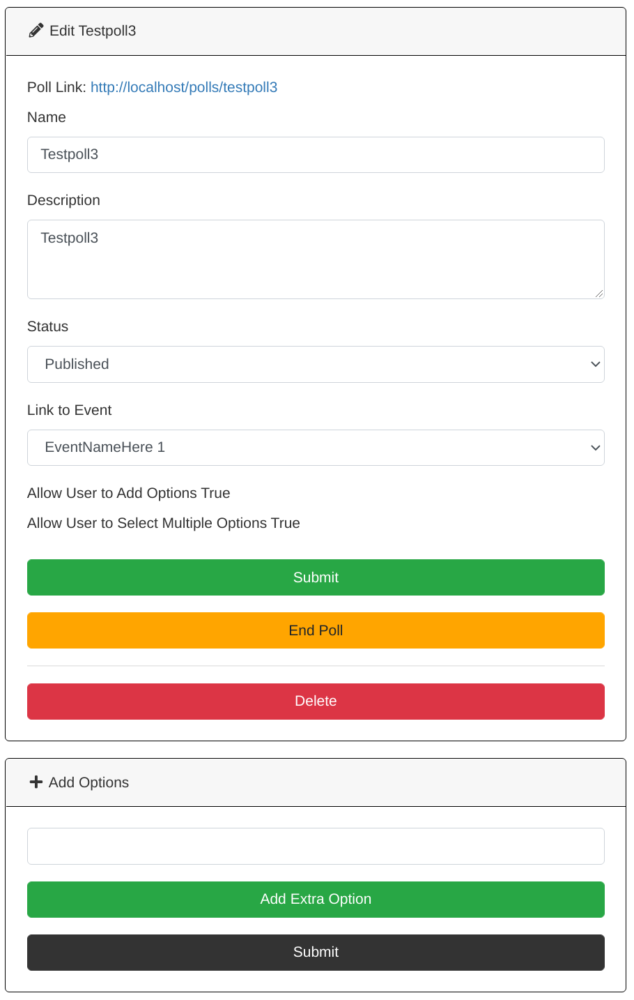
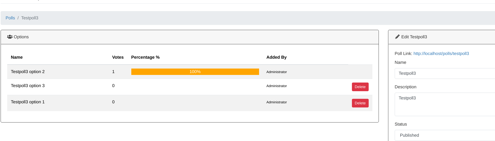
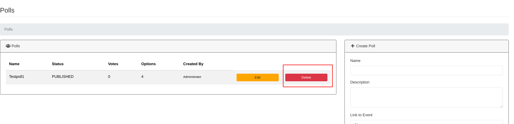

Polls
==================================================
You can create polls which will be shown either on the polls page of eventula or an specified event. 
You can give the users the ability to select only one option or multiple options and you can allow or deny the addition of own answers by users.
In every case all registered users can vote!

Add poll
-----------------

Lets create a News article! go to your Admin Panel to the ``Polls`` Section and you can Write your entry in the ``Create Poll`` area.

Fill in a name and a description for your poll and add at least one option to it (you can add more with the ``Add Extra Option`` button).

When you associate no event with the poll it will be showed on the public Polls page (reachable in the footer Navigation) or via a Link to it.

When you associate an event with the poll it will be showed on the events page only. 

You will then be redirected to the detailed / editing view for your poll and in order to make it publicly available you have to set the ``Status`` to ``Published`` and save the Poll with the Submit button:

A poll on the poll page will look like this:

If a user clics on it, it will look like this:

A poll on an events page will look like this:

Edit poll / View poll results / End poll 
----------
To edit a poll klick on the edit button of your poll entry in the ``Polls`` area.

You have now the ability to add new options to the poll, change the name, description and the associated event and end the poll (so users cant vote anymore).

You also can see the results of the vote:

Delte poll
-----------

To delete a poll simply click ``Delete`` on the ``Polls`` list entry and confirm the upcoming messagebox:

