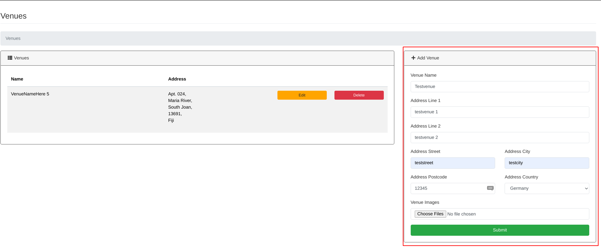
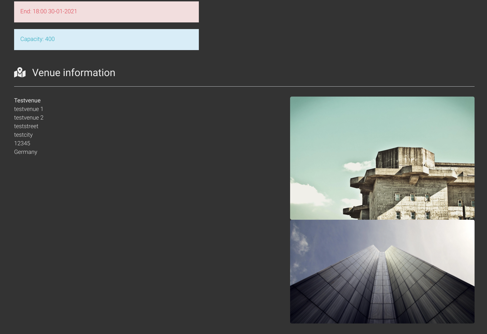
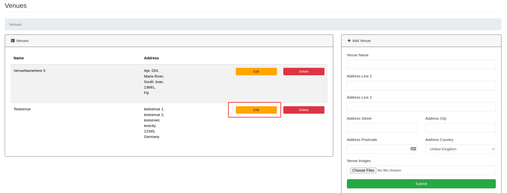
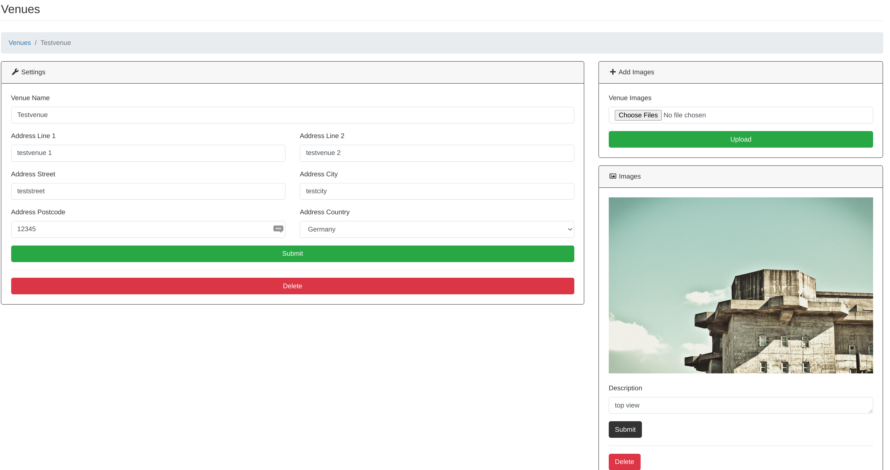
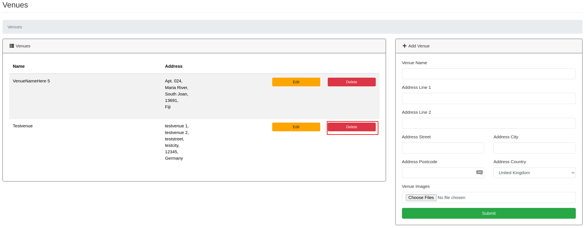

Venues
==================================================
You can create venues for your events so you dont need to enter the adress for every event.

Add Venue
-----------------

Lets create a Venue! go to your Admin Panel to the ``Venues`` Section and you can Write your entry in the ``Add Venue`` area.
You have to fill everything and you can add a image if you want:

Press ``Submit`` to add the entry.

You will then be redirected to the detailed / editing view.

The venue details will be shown on the events page when you associate the venue to the event (sample pictures from https://unsplash.com/ ):

Edit Venue
-----------------
To edit a venue simply click ``Edit`` on the ``Venues`` list entry:

You will then be redirected to the detailed / editing view, here you can edit all the details and you also can add/delete associated image(s) there.

Delete Venue
--------------------

To delete a venue simply click ``Delete`` on the ``Venues`` list entry and confirm the upcoming messagebox:

